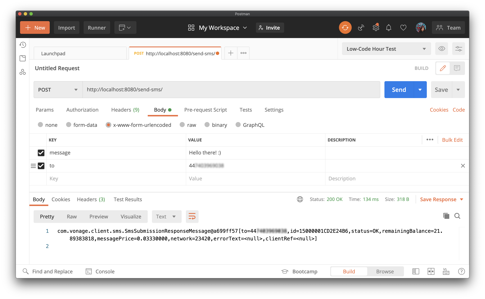

# ⚠️ This repository is no longer maintained.

## Support Notice
This is an archived repository. If you have any questions, feel free to reach out to us at devrel@vonage.com or through our Community Slack at https://developer.vonage.com/community/slack.

Example project that shows how to create an SMS Web Service with Java. Go to the [tutorial](ADD_LINK_WHEN_PUBLISHED) to follow along and build it from scratch.

We've used JDK 11, Gradle 7.1, Gretty 3.0.5, and the Vonage Server SDK for Java v.6.4.0
> Note: JDK 16 isn't yet supported by the Gretty plug-in.

## Running Instructions

Clone the project and open the `src/main/webapp/WEB-INF/web.xml` file.

Replace `VONAGE_API_KEY` and `VONAGE_API_SECRET` with the values found in your [Vonage API Dashboard](https://dashboard.nexmo.com/). You'll need to replace `VONAGE_BRAND_NAME` with one of your Vonage [virtual numbers](https://dashboard.nexmo.com/your-numbers).

> Note: In some countries (US), `VONAGE_BRAND_NAME` has to be one of your Vonage virtual numbers. In other countries (UK), you're free to pick an alphanumeric string value—for example, your brand name like AcmeInc. Read about country-specific SMS features on the [dev portal](https://developer.vonage.com/messaging/sms/guides/country-specific-features).

Run `gradle build`, then `gradle appRun` in the project folder to start it.

Use[Postman](https://www.getpostman.com/) to make a POST request to `http://localhost:8080/send-sms/`, specifying `message` and `to` in the body:

Run `gradle --stop` to stop it.
